<div align="center">
<!-- HEADER SVG — Cyber-styled network transfer banner -->
<svg width="100%" viewBox="0 0 900 220" xmlns="http://www.w3.org/2000/svg">
  <defs>
    <linearGradient id="bg" x1="0%" y1="0%" x2="100%" y2="100%">
      <stop offset="0%" style="stop-color:#0a0a0f"/>
      <stop offset="35%" style="stop-color:#0d0221"/>
      <stop offset="65%" style="stop-color:#130a2e"/>
      <stop offset="100%" style="stop-color:#1a0a3d"/>
    </linearGradient>
  </defs>
  <rect width="900" height="220" fill="url(#bg)"/>
  <ellipse cx="850" cy="60" rx="200" ry="60" fill="#3b82f6" opacity="0.1"/>
  <ellipse cx="80" cy="160" rx="150" ry="40" fill="#22c55e" opacity="0.08"/>
  <path d="M0,170 Q300,130 450,165 Q600,200 900,150 L900,220 L0,220 Z" fill="#2563eb" opacity="0.12"/>
  <text x="450" y="105" font-family="'Segoe UI', Arial, sans-serif" font-size="52" font-weight="900" fill="#3b82f6" text-anchor="middle" letter-spacing="5">LAN DROP</text>
  <text x="450" y="145" font-family="'Segoe UI', Arial, sans-serif" font-size="16" font-weight="400" fill="#a78bfa" text-anchor="middle" letter-spacing="2">High-Speed Local Area Network File Sharing Engine</text>
</svg>

<!-- ANIMATED TYPING INDICATOR -->
<a href="https://git.io/typing-svg">
  
</a><br/>

<!-- CORE BADGES -->

&nbsp;

&nbsp;

</div>


◈ Ecosystem Blueprint

<table>
<tr>
<td width="55%">

```javascript
// lan_drop_manifest.js
const projectSpecs = {
  architecture : "Monorepo / Multi-Target Wrapper",
  transport    : "Socket.io Websockets (P2P Mesh)",
  dependencies : "No Cloud / Pure Local Area Network",
  
  distribution : {
    core_web : "Vite + React 19 + Tailwind 4",
    android  : "Capacitor Runtime Wrapper",
    desktop  : "Electron Shell Native Native Windows"
  },
  
  storage_policy : "Auto-Cleanup Transient Memory Loop"
};

```

◈ Capabilities at a Glance

◈ Monorepo Structure Segregation

```mermaid
graph TD
    Root[LAN Drop Monorepo Root] --> CoreBackend[./backend <br> Node.js/Express Server]
    Root --> CoreFrontend[./frontend <br> React 19 / Tailwind 4 Base]
    
    CoreFrontend --> MobileApp[./mobile-app <br> Android Wrapper via Capacitor]
    CoreFrontend --> WindowsApp[./windows-app <br> Desktop Shell via Electron]
    
    style CoreBackend fill:#1e1b4b,stroke:#3b82f6,stroke-width:2px;
    style CoreFrontend fill:#0d1e2d,stroke:#22c55e,stroke-width:2px;
    style Root fill:#111,stroke:#a855f7,stroke-width:1px;

```



### Reference Documentation Core

* 🏗️ **[Architecture Matrix](https://www.google.com/search?q=./docs/ARCHITECTURE.md)** — In-depth analysis of local network discovery and packet transfer pipelines.
* ⚙️ **[Technical Specifications](https://www.google.com/search?q=./docs/TECH_SPEC.md)** — Event registration matrices, API schemas, and transport details.
* 💻 **[Development Instructions](https://www.google.com/search?q=./docs/DEVELOPMENT.md)** — Monorepo setup rules and workflow tracking guide.

◈ Quick-Start Dev Environments

### 📡 Phase 1: Deploy Network Host API Backend

```bash
cd backend
npm install
npm run dev

```

### 🎨 Phase 2: Deploy Client Frontend Server

```bash
cd frontend
npm install
npm run dev

```

### 🌐 Phase 3: Access Workspace Node

Open your browser window directly onto the local testing loop link:

```text
URL Anchor: http://localhost:5173

```

◈ Architecture Mapping Layout

| Domain Path | Operational Context Target Matrix | Underlying Engine |
| --- | --- | --- |
| `[./backend]` | Handles routing connections, file allocations, and event pipelines | Node.js + Express + Socket.io |
| `[./frontend]` | Core interface logic, Drag & Drop fields, configuration panels | React 19 + Vite + Tailwind 4 |
| `[./mobile-app]` | Native device integration context and mobile frame deployments | Capacitor Wrapper |
| `[./windows-app]` | Standardized standalone native execution shell for Windows hosts | Electron Engine |

◈ Open Contribution & Licensing

* Open source collaboration policies are registered inside the dev workflow modules.
* Distributed natively under the terms and parameters of the **ISC License Framework**.
